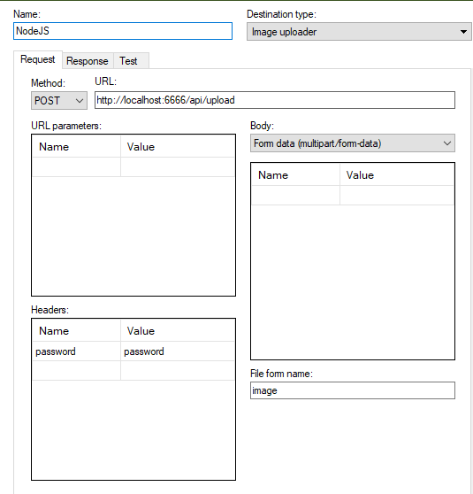
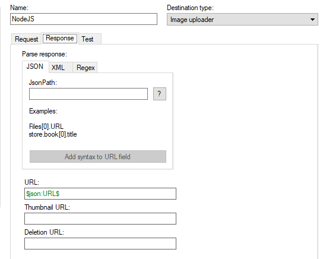

# sharex-server (NodeJS)

### Requirements
- [Node.js](https://nodejs.org/en)

### Usage
- `npm install sharex-server`
- 
```js
const Server = require('sharex-server');

new Server({
        password: 'password',
        path: 'definitely/not/my/nudes',
        port: 6666,
        fileLength: 10
})
```
- Enjoy

### ShareX - Custom uploader settings


